## GitHub
### 注册 GitHub
- 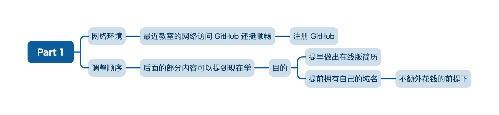
### 开启 GitHub Pages
- 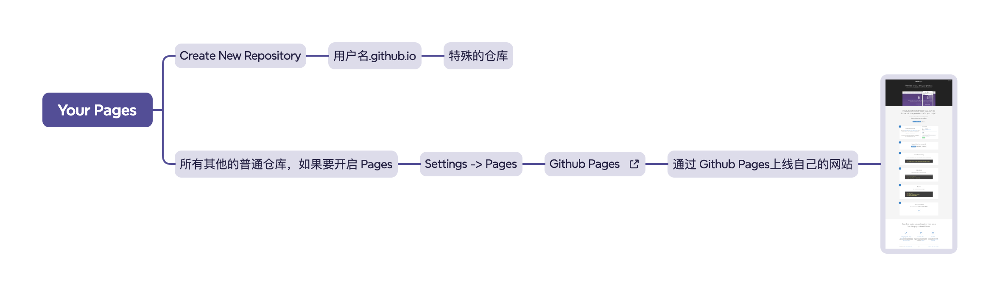
- https://pages.github.com/
- 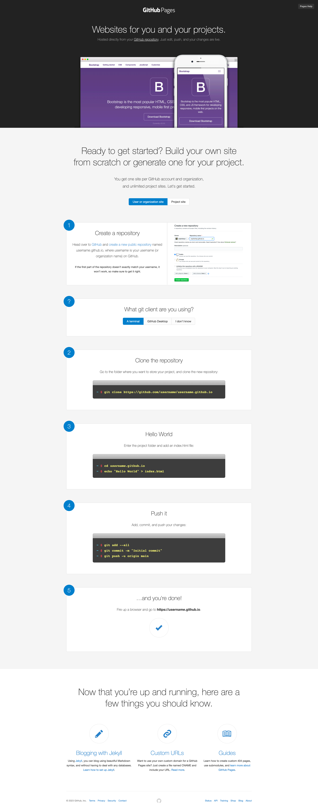

## VS Code
- 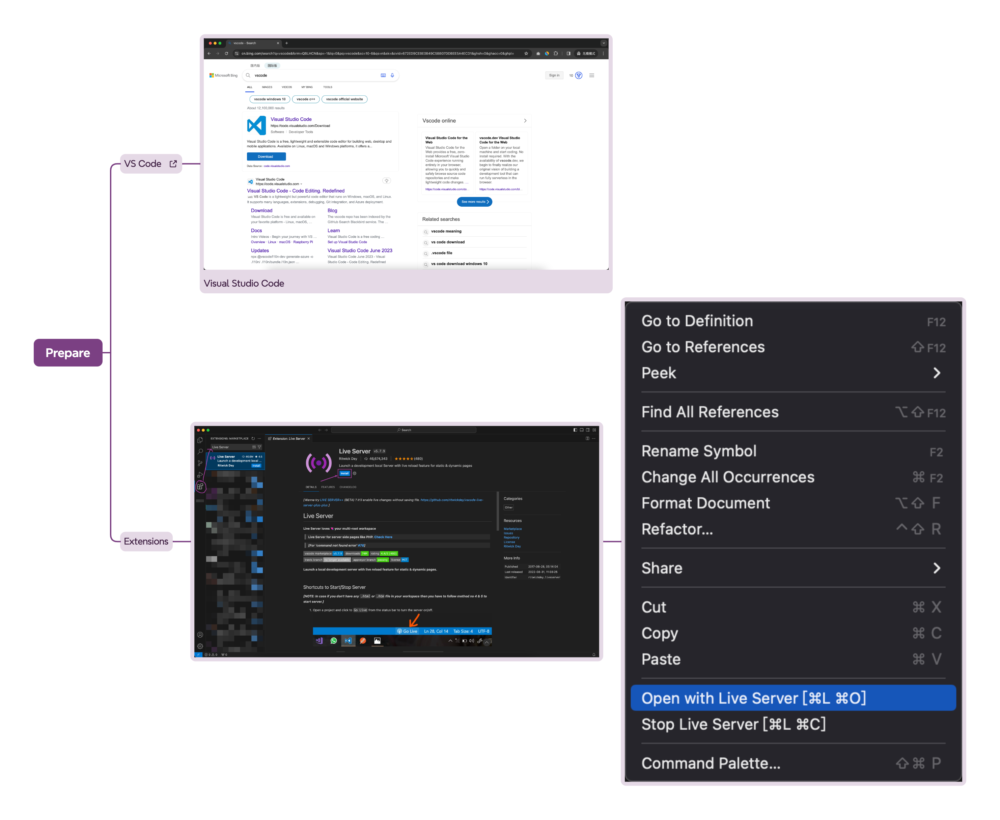
- File -> Open Folder...
- resume
- 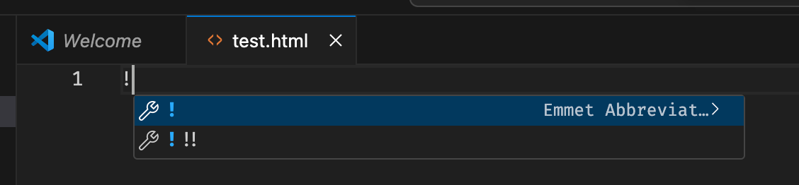
- 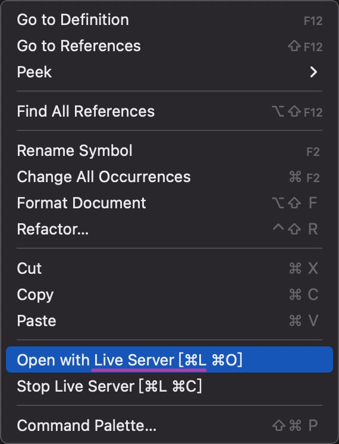
- 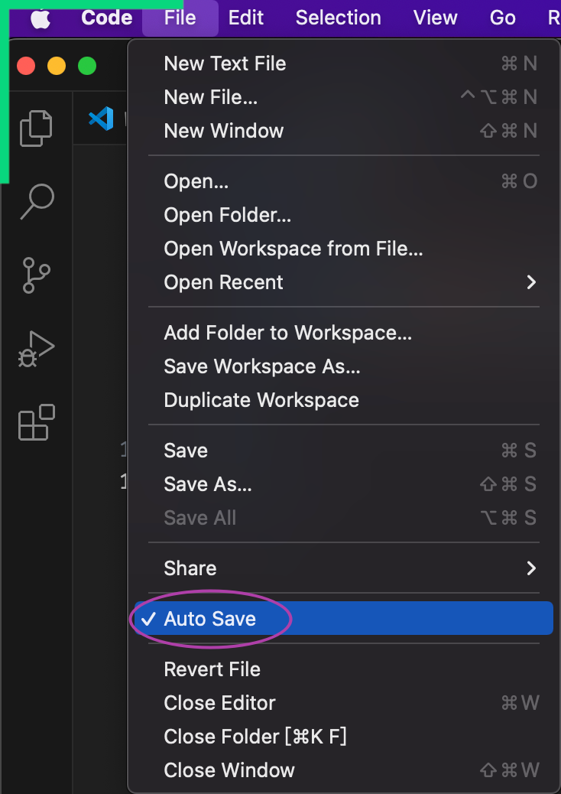

## 跟浏览器对话
我们是在跟浏览器对话
- 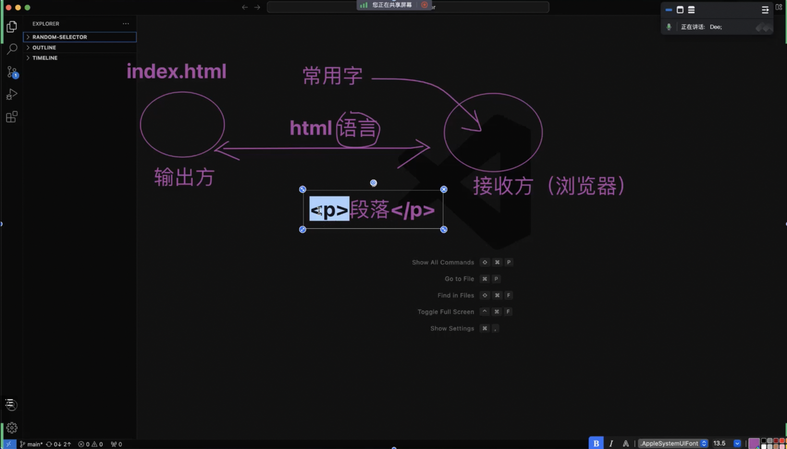
- 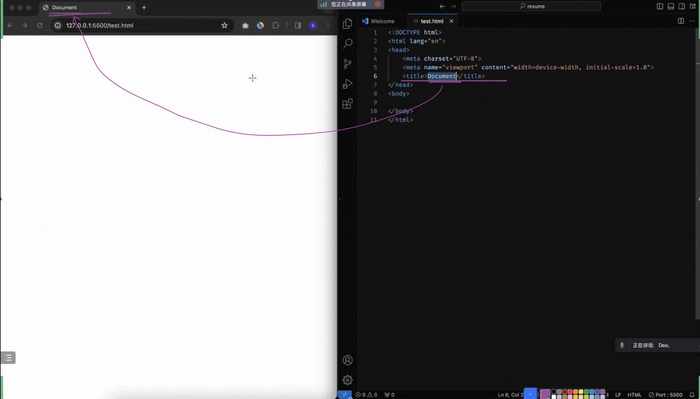
- 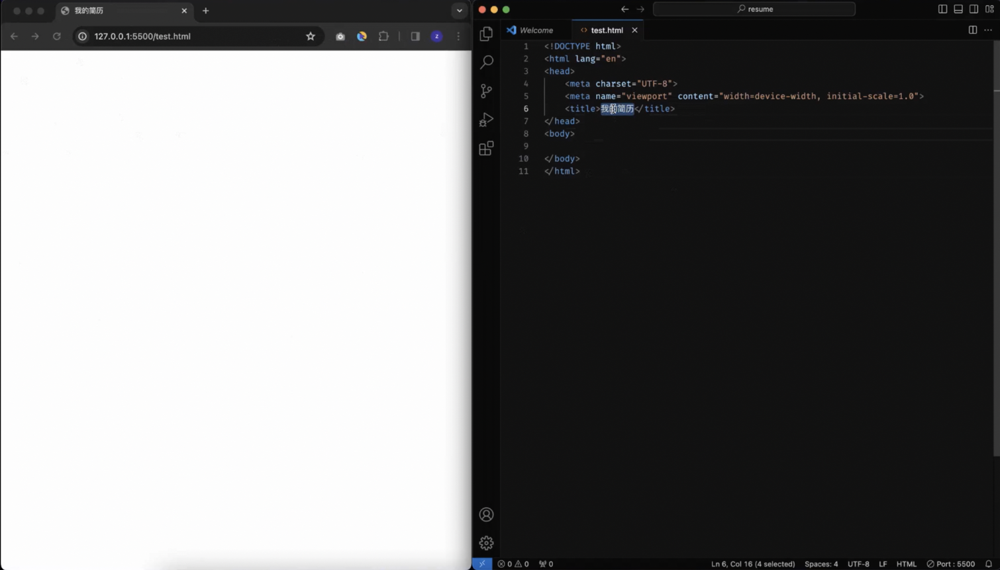

## 常用“字”
- 母语学习经历告诉我们：不用等整本字典学完才敢说话、写字
- html 学习也一样
- 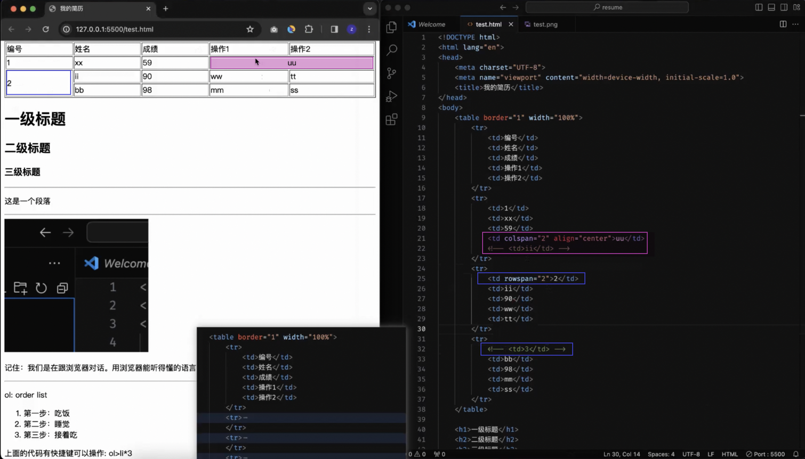

## 作业
- 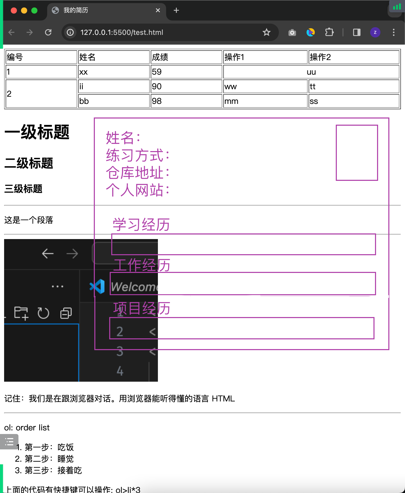