## 快速复习上节课的重点
- 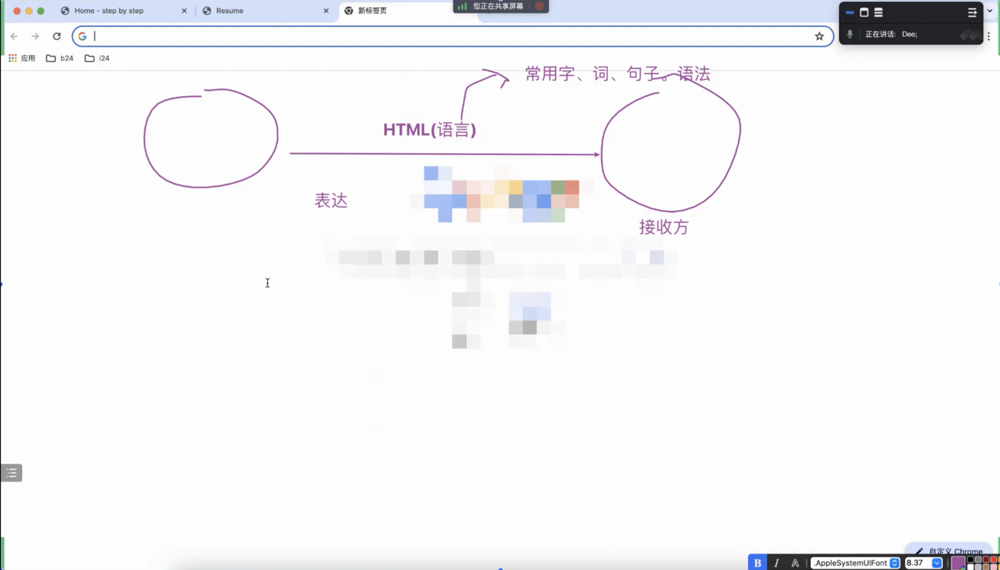
### 新字练习：`<a>`
- 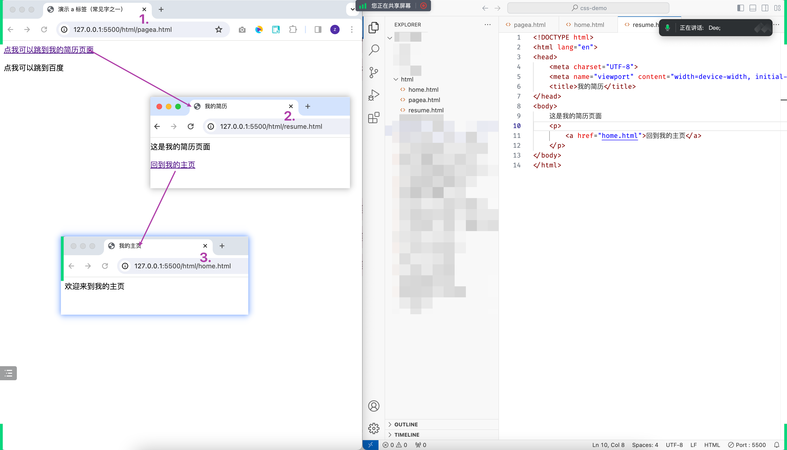
- 等等...

## 从几个问题开始
### `www` 是什么？
- 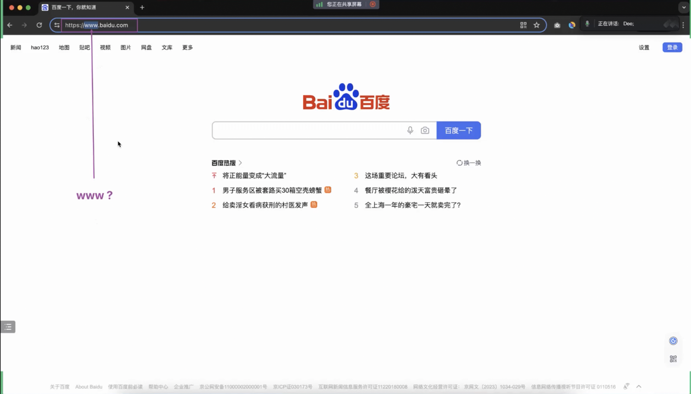
### `CSS` 是什么？
- 有同学知道：层叠样式表
### `层叠`是什么？
- `技术`源自`生活`/`自然界`

## 一手资源之视频，`CSS`作者的演讲
- 
- 
- 
- 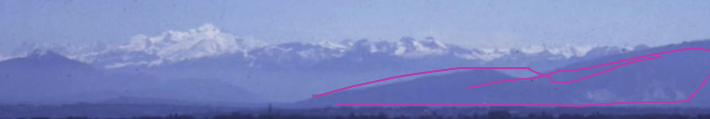
- 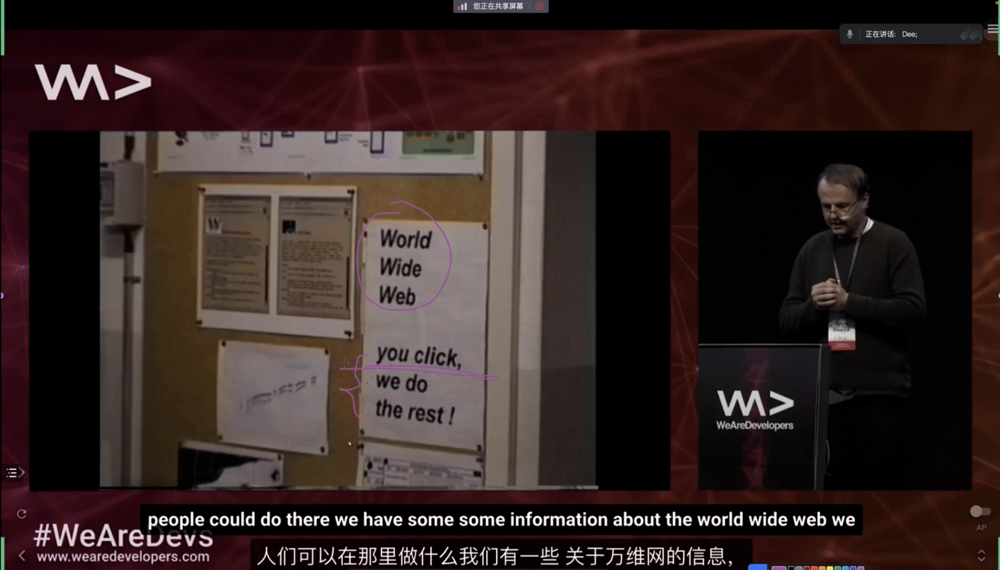

## Web 开发三大技术基石之`CSS`
- 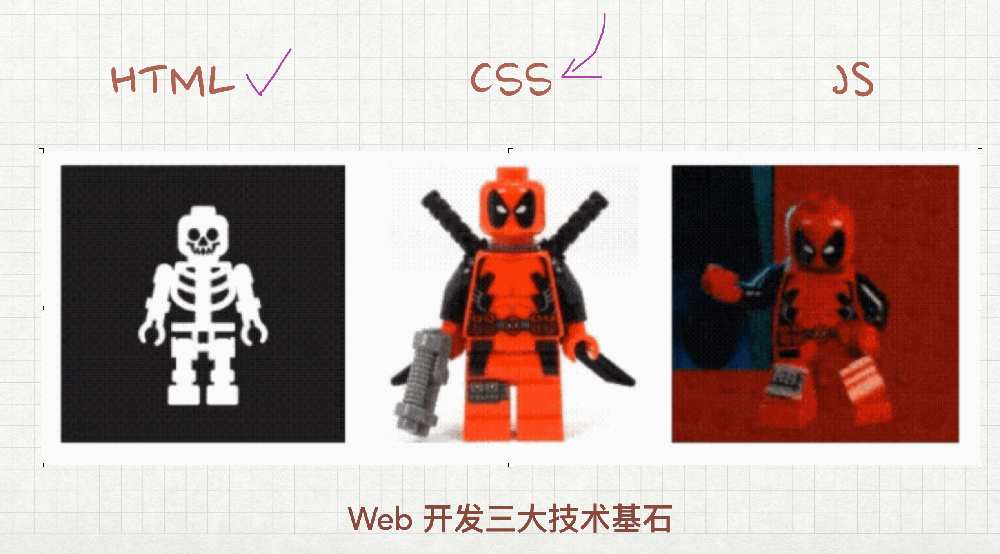

## 找到它，改变它
- 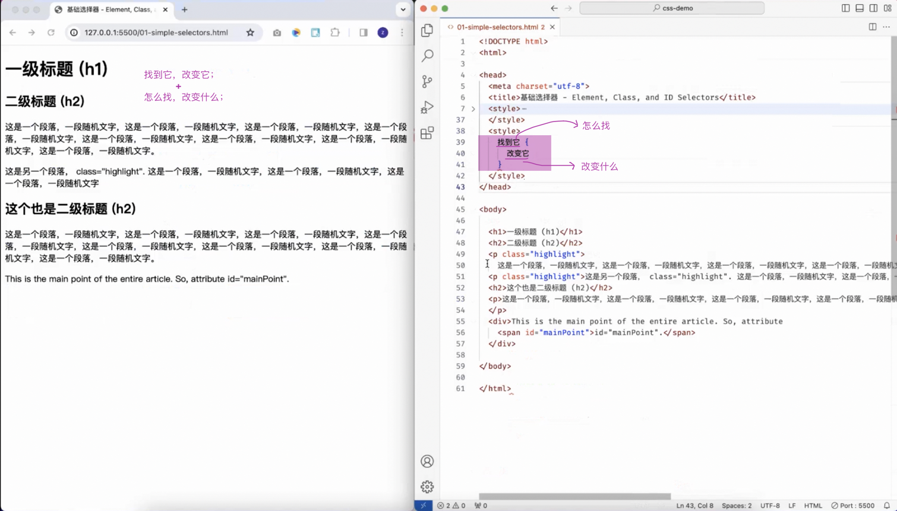
### 样式位置
- 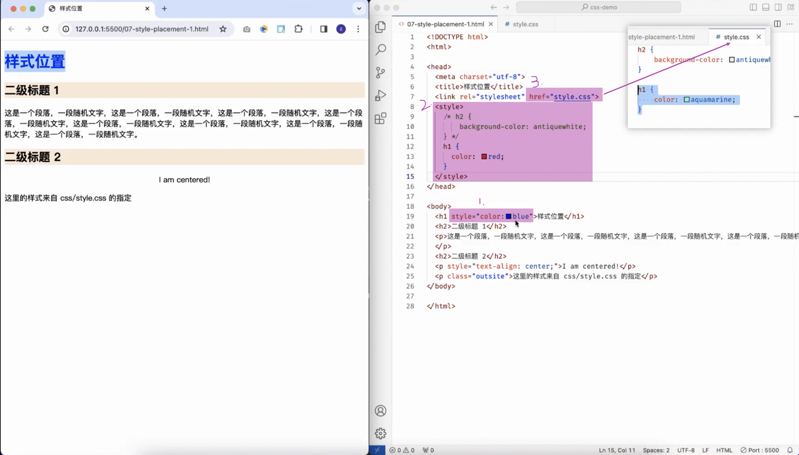

### 找到它，之`怎么找`的练习
- 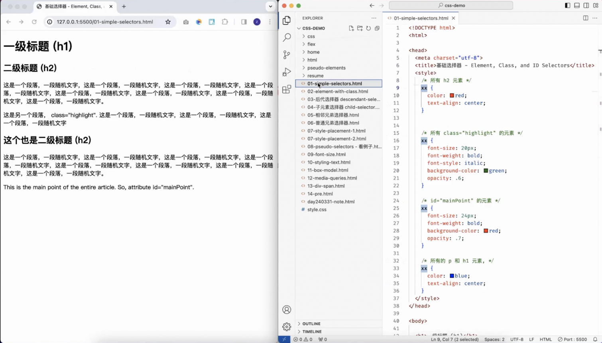
- 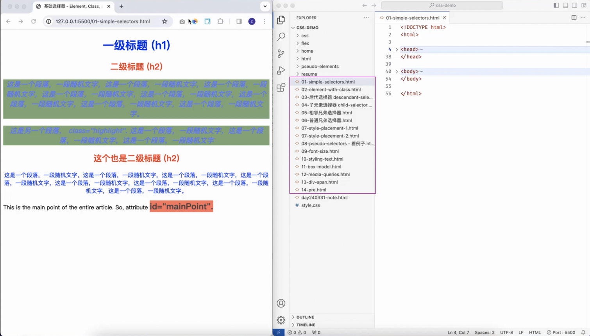

### 改变它，之`可以改变什么`的练习
- 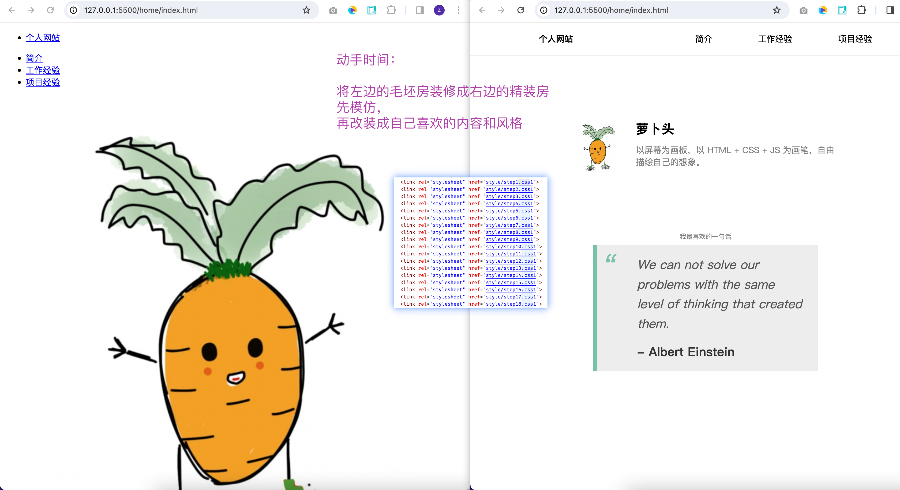