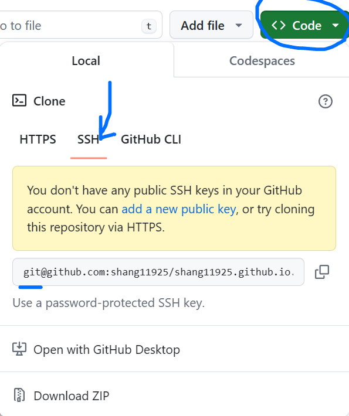

## Random Selector 同时支持跳转到 gitee 和 github 仓库地址
- 

## 学习资源推荐
- 

## grid system
- 
- 

## 配置 SSH 免密登录
### 生成并添加公钥到远程
- 
- 
- 
- 
- 
- 
### 验证是否配置成功
- 
- 
### 修改本地和远程的关联地址，从 https => git
- 
- 
- 

## content
- 

## font
- 

## space
- 

## color
- 
- 
- 
- 
- 

## 感觉/艺术背后的科学支撑
- 

## Web 开发三大技术基石之 `JavaScript`
- 
- 

### 编程的本质
- 

### JavaScript 初见
- 

### 动手时间：复现百度首页控制台的输出
- 

### 从 `onclick` 开始
- 
- 

### 聚焦在浏览器中执行的 JavaScript
- 

### 常用事件
- 

### BOM
- 

### DOM
- 
- 
- 

### 别人写好的 JavaScript 之 `jQuery`
- 
- 
- 还有很多其他的第三方库。。。

## 浏览器插件
### hello-chrome-extension
- 
- 
### video-playback-rate
- 
- 

### 加载已解压的扩展程序
- 

